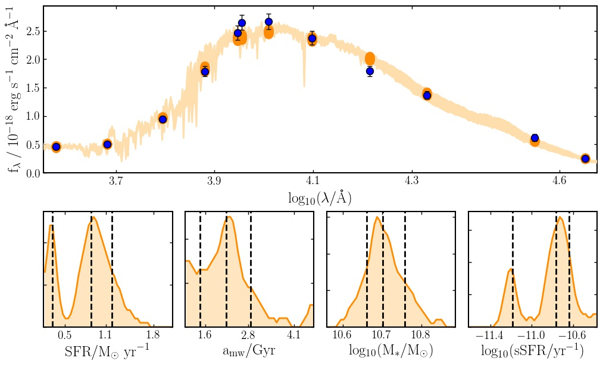
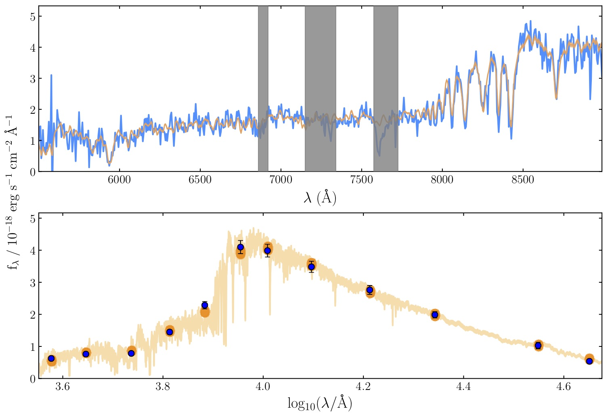

**Bayesian Analysis of Galaxies for Physical Inference and Parameter EStimation**

Bagpipes is a state of the art code for generating realistic model galaxy spectra and fitting these to spectroscopic and photometric observations. For further information please see the Bagpipes documentation at `bagpipes.readthedocs.io <http://bagpipes.readthedocs.io>`_.

Bagpipes can be installed with pip:

.. code::

    pip install bagpipes

Please note you cannot run the code just by cloning the repository as the large grids of models aren't included.

An example fit to photometry:

An example joint fit to spectroscopic and photometric data:

