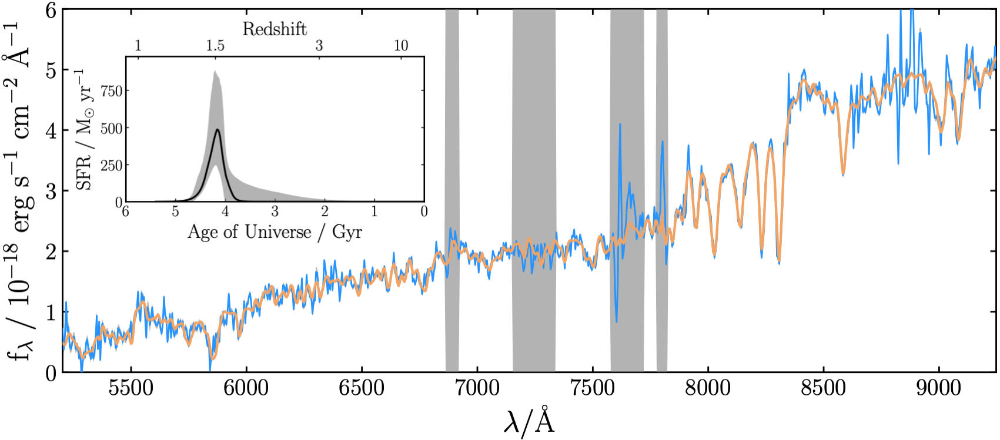

**Bayesian Analysis of Galaxies for Physical Inference and Parameter EStimation**

**Modified version of Bagpipes 1.2.0**

**Changes**

1. Saving advanced quantities to .h5, which increases speed up of loading in already computed models.
2. Adding new quantites: UV Beta slope (in Calzetti filters), absolute and apparent UV magnitudes, Emission line equivalent widths and fluxes, escape fraction, ionizing photon production efficiency (use with caution). 
3. Multiple SFH timescales - 10 and 100 Myr by default.
4. Calculating and plotting cumulative star formation histories, to trace buildup of stellar mass.
5. Allow varying of fit_instructions dictionary inside a fitting catalogue, and allowing different redshift constraints for each galaxy.
6. Compressing .h5 outputs to improve space efficiency.

If you clone this repo you will have to download the grids seperately - you can download the grids from the Python Package index (pip) `here <https://pypi.org/project/bagpipes/#files>`_, and place them in the models/grids directory. You can then install by typing  ``pip install setup.py`` (add a -e tag if you want to link it directly to your cloned version, otherwise it will be copied into your site-packages directory. 

Bagpipes is a state of the art code for generating realistic model galaxy spectra and fitting these to spectroscopic and photometric observations. For further information please see the Bagpipes documentation at `bagpipes.readthedocs.io <http://bagpipes.readthedocs.io>`_.

**Sampling algorithms within Bagpipes**

The default sampler (and historically the only option) for fitting models to data is the `MultiNest <https://github.com/JohannesBuchner/MultiNest>`_ code, however this requires separate installation, which can be challenging on some systems. Bagpipes is now also compatible with the pure Python `nautilus <https://github.com/johannesulf/nautilus>`_ nested sampling algorithm, which is now installed by default along with Bagpipes, and will be automatically used for fitting if MultiNest is not installed. Even if you are used to using Bagpipes with Multinest, you may wish to try out Nautlus, as this may yield faster and/or more accurate results in some circumstances. For more information please see the `bagpipes documentation <http://bagpipes.readthedocs.io>`_.

**Published papers and citing the code**

Bagpipes is described primarily in Section 3 of `Carnall et al. (2018) <https://arxiv.org/abs/1712.04452>`_, with further development specific to spectroscopic fitting described in Section 4 of `Carnall et al. (2019b) <https://arxiv.org/abs/1903.11082>`_. These papers are the best place to start if you want to understand how the code works.

If you make use of Bagpipes, please include a citation to `Carnall et al. (2018) <https://arxiv.org/abs/1712.04452>`_ in any publications. You may also consider citing `Carnall et al. (2019b) <https://arxiv.org/abs/1903.11082>`_, particularly if you are fitting spectroscopy.

Please note development of the code has been ongoing since these works were published, so certain parts of the code are no longer as described. Please inquire if in doubt.

