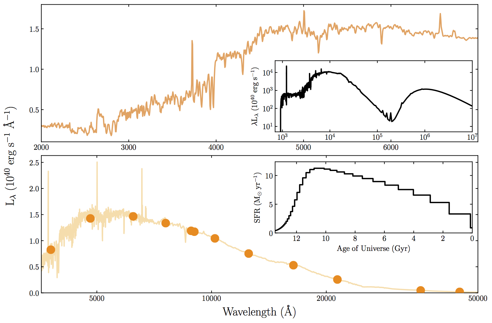
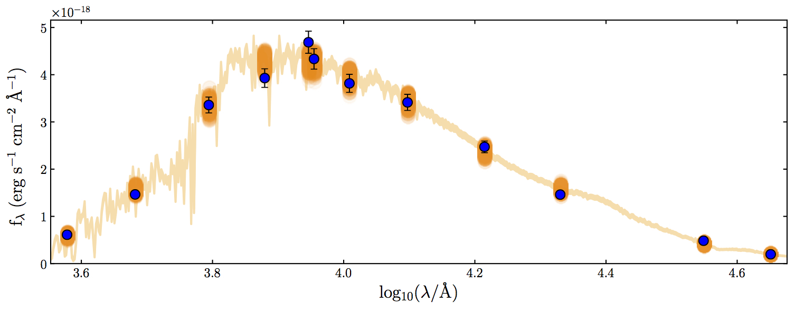
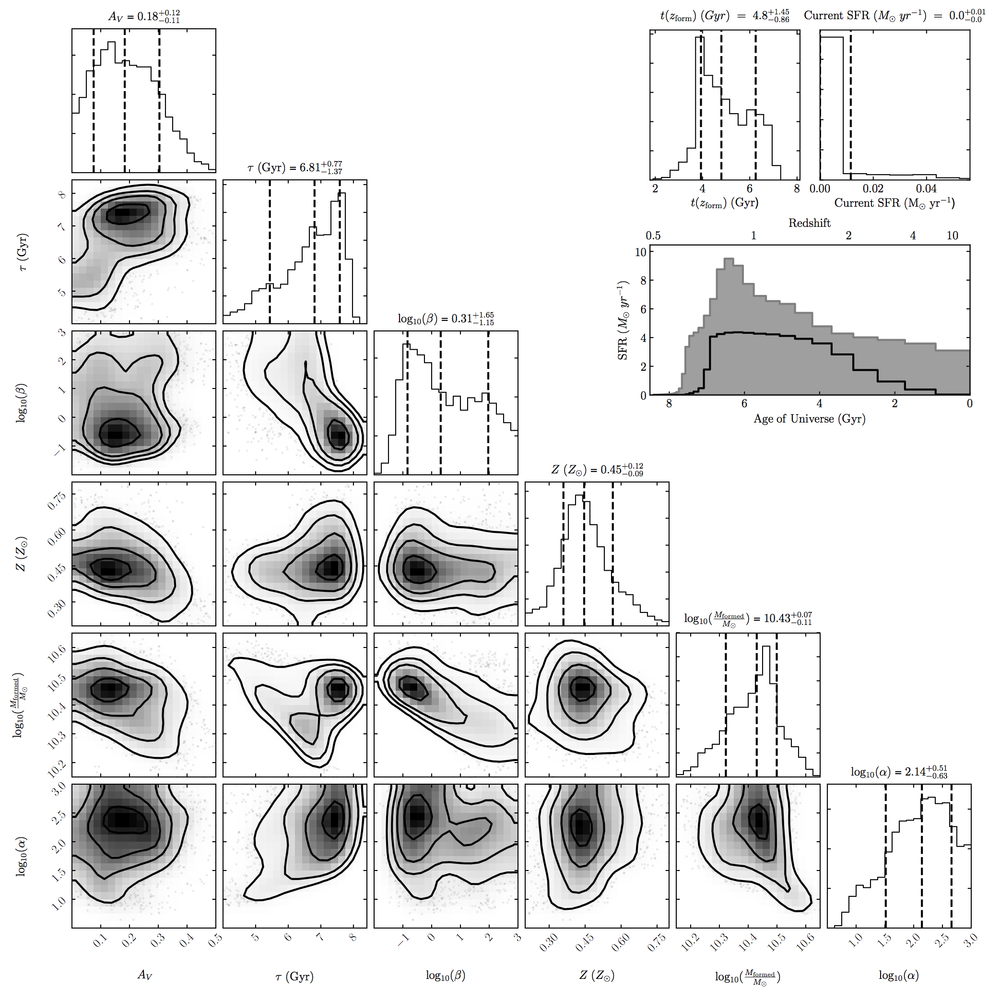

BAGPIPES
========

Bayesian Analysis of Galaxies for Physical Inference and Parameter EStimation
-----------------------------------------------------------------------------

Bagpipes is a state of the art model galaxy generation framework and fitting tool. It is designed to generate a highly diverse range of complex model galaxy spectra, and to fit these models to arbitrary combinations of spectroscopic and photometric data using the `MultiNest <https://ccpforge.cse.rl.ac.uk/gf/project/multinest>`_ algorithm.

Documentation
-------------

The Bagpipes documentation can be found `here <http://www.roe.ac.uk/~adamc/bagpipes_docs/index.html>`_, this is currently a work in progress, but most of the key elements are there. You will also find a suite of examples in the examples folder of this repository.  

Bagpipes is described in Section 3 of `ArXiv1712.99999 <https://arxiv.org/abs/1712.99999>`_, if you make use of Bagpipes in your research, please cite this work.

