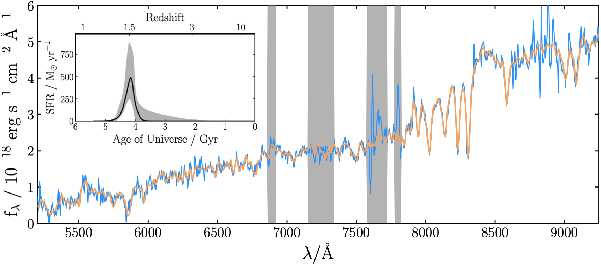
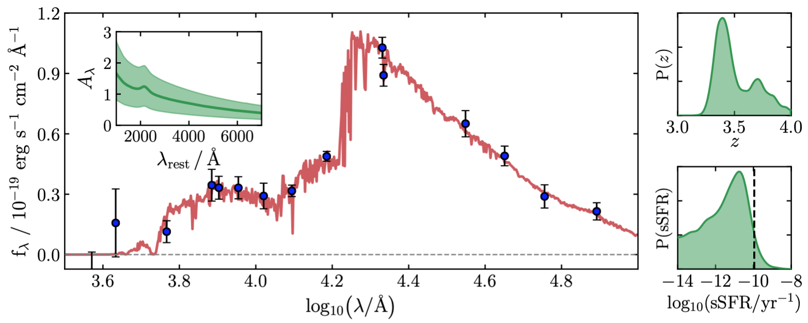

Bagpipes
========

Bayesian Analysis of Galaxies for Physical Inference and Parameter EStimation is a state of the art Python code for modelling galaxy spectra and fitting spectroscopic and photometric observations.

I hope you will find everything you need to know here, however feel free to get in touch if you have further questions, or to get an opinion on specific use cases. I've recently added a :ref:`latest news <latest-news>` page, which I'll use to track updates to the code and any issues people make me aware of.

What can Bagpipes do?
---------------------

Star-formation history recovery from spectroscopy (see `Carnall et al. 2019b <https://arxiv.org/abs/1903.11082>`_)

Identification of z > 3 quiescent galaxies from photometry (see `Carnall et al. 2020 <https://arxiv.org/abs/2001.11975>`_)

Bagpipes has been used in ~230 papers as of March 2024. For more example use cases take a look at this `ADS library listing papers that use Bagpipes <https://ui.adsabs.harvard.edu/public-libraries/VOrR8ITjTTSYNXVYiQ1oag>`_.

Source and installation
-----------------------

Bagpipes is `developed at GitHub <https://github.com/ACCarnall/bagpipes>`_, however the code cannot be installed from there, as the large model grid files aren't included in the repository. The code should instead be installed with pip:

.. code::

    pip install bagpipes

All of the code's Python dependencies will be automatically installed.

Sampling algorithms within Bagpipes
-----------------------------------

Historically, fitting with Bagpipes has relied on the `MultiNest <https://github.com/JohannesBuchner/MultiNest>`_ nested sampling algorithm, a non-Python dependency that requires separate installation. This is sometimes challenging on certain systems. Recently, Bagpipes has been updated such that it will now automatically use the Python-based `nautilus <https://nautilus-sampler.readthedocs.io/en/stable/>`_ sampler for fitting if MultiNest is not installed. If you wish to use MultiNest, the installation instructions below may be of assistance.

The simplest way to install MultiNest if you have an anaconda python disribution is with the command **conda install -c conda-forge multinest**.

Failing this, see point 1 of the "on your own computer" section of the `PyMultiNest installation instructions <http://johannesbuchner.github.io/pymultinest-tutorial/install.html>`_. The instructions for specific cases below may also be of use:

In my experience, the sequence of commands necessary to install MultiNest on an **intel** mac (with `Homebrew
<https://brew.sh/>`_ installed) is as follows:

.. code::

    git clone https://github.com/JohannesBuchner/MultiNest
    brew install gcc49
    export DYLD_LIBRARY_PATH="/usr/local/bin/gcc-4.9:$DYLD_LIBRARY_PATH"
    cd MultiNest/build
    cmake ..
    make
    sudo make install
    cd ../..
    rm -r MultiNest

On an **Apple Silicon** mac, the sequence of commands might be slightly different because `homebrew changed its default installation path <https://brew.sh/2021/02/05/homebrew-3.0.0/>`_.

.. code::

    git clone https://github.com/JohannesBuchner/MultiNest
    brew install gcc cmake
    export DYLD_LIBRARY_PATH="/opt/homebrew/bin/gcc-13:$DYLD_LIBRARY_PATH"
    cd MultiNest/build
    cmake ..
    make
    sudo make install
    cd ../..
    rm -r MultiNest

Note: Depending on when you install, the gcc version might be different. One can check gcc's version with `brew info gcc` and check if it is still installed at the right place `ls /opt/homebrew/bin/gcc*`. If your version differs from gcc-13, then you can easily update the third command with the correct path.

If you are running a Linux operating system, or have MacPorts instead of Homebrew, you may run into additional issues. I may be able to provide advice if you get stuck.

Published papers and citing the code
------------------------------------

Bagpipes is described primarily in Section 3 of `Carnall et al. (2018) <https://arxiv.org/abs/1712.04452>`_, with further development specific to spectroscopic fitting described in Section 4 of `Carnall et al. (2019b) <https://arxiv.org/abs/1903.11082>`_. These papers are the best place to start if you want to understand how the code works.

If you make use of Bagpipes, please include a citation to `Carnall et al. (2018) <https://arxiv.org/abs/1712.04452>`_ in any publications. You may also consider citing `Carnall et al. (2019b) <https://arxiv.org/abs/1903.11082>`_, particularly if you are fitting spectroscopy.

Please note development of the code has been ongoing since these works were published, so certain parts of the code are no longer as described. Please inquire if in doubt.

Getting started
---------------

The best place to get started is by looking at the `iPython notebook examples <https://github.com/ACCarnall/bagpipes/tree/master/examples>`_. It's a good idea to tackle them in order as the later examples build on the earlier ones. These documentation pages contain a more complete reference guide.

Bagpipes is structured around three core classes:

 - :ref:`model_galaxy <making-model-galaxies>`: for generating model galaxy spectra
 - :ref:`galaxy <inputting-observational-data>`: for loading observational data into Bagpipes
 - :ref:`fit <fitting-observational-data>`: for fitting models to observational data.

Acknowledgements
----------------

A few of the excellent projects Bagpipes relies on are:

 - The `Bruzual \& Charlot (2003) <https://arxiv.org/abs/astro-ph/0309134>`_ stellar population models.
 - The `Draine \& Li (2007) <https://arxiv.org/abs/astro-ph/0608003>`_ dust emission models.
 - The `MultiNest <https://ccpforge.cse.rl.ac.uk/gf/project/multinest>`_ nested sampling algorithm `(Feroz et al. 2013) <https://arxiv.org/abs/1306.2144>`_
 - The `PyMultiNest <https://johannesbuchner.github.io/PyMultiNest>`_ Python interface for Multinest `(Buchner et al. 2014) <https://arxiv.org/abs/1402.0004>`_.
 - The `Cloudy <https://www.nublado.org>`_ photoionization code `(Ferland et al. 2017) <https://arxiv.org/abs/1705.10877>`_.
 - The `nautilus <https://nautilus-sampler.readthedocs.io/en/stable/>`_ importance nested sampling algorithm `(Lange 2023) <https://arxiv.org/abs/2306.16923>`_.

 .. toctree::
    :maxdepth: 1
    :hidden:

    index.rst
    latest_news.rst
    model_galaxies.rst
    model_components.rst
    loading_galaxies.rst
    fitting_galaxies.rst
    fit_instructions.rst
    fitting_catalogues.rst
    extra_models.rst
