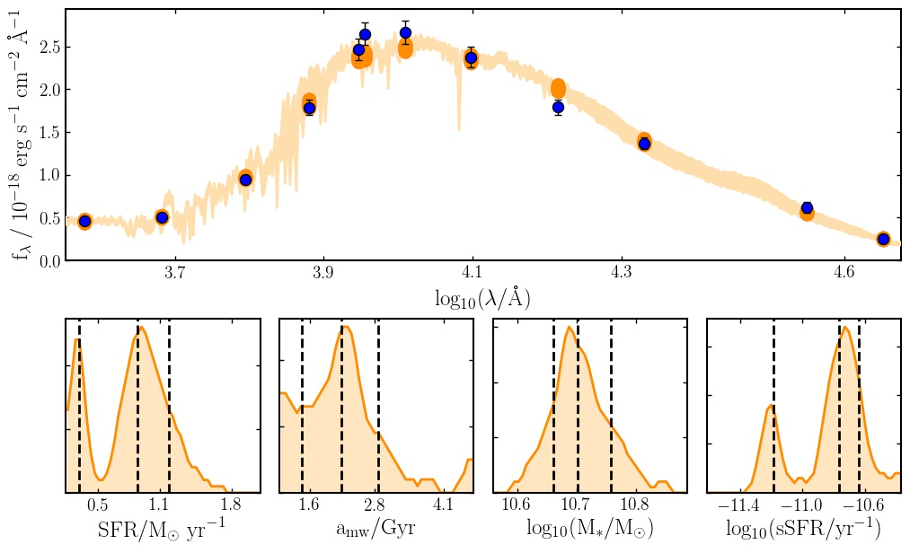

Bayesian Analysis of Galaxies for Physical Inference and Parameter EStimation is a state of the art Python code for modelling galaxy spectra and fitting spectroscopic and photometric observations.

Source and installation
-----------------------

See the `installation <installation.html>`_ page for information on how to download the latest Bagpipes distribution.

Bagpipes is developed at GitHub, view the source `here <https://github.com/ACCarnall/bagpipes>`_.

Getting started
---------------

The best place to get started with the code is by looking at the `iPython notebook examples <https://github.com/ACCarnall/bagpipes/tree/master/examples>`_. It's a good idea to tackle them in order as the later examples build on the earlier ones.

Acknowledgements
----------------

Bagpipes is described in Section 3 of `Carnall et al. 2017 <https://arxiv.org/abs/1712.04452>`_, if you make use of Bagpipes in your research, please include a citation to this work in any publications. 

Just a few of the excellent projects Bagpipes relies on are:

 - The `MultiNest <https://ccpforge.cse.rl.ac.uk/gf/project/multinest>`_ nested sampling algorithm `(Feroz et al. 2013) <https://arxiv.org/abs/1306.2144>`_
 - The MultiNest python interface `PyMultiNest <https://johannesbuchner.github.io/PyMultiNest>`_ `(Buchner et al. 2014) <https://arxiv.org/abs/1402.0004>`_.
 - The stellar population models of `Bruzual \& Charlot (2003) <https://arxiv.org/abs/astro-ph/0309134>`_.
 - The `Cloudy <https://www.nublado.org>`_ photoionization code `(Ferland et al. 2017) <https://arxiv.org/abs/1705.10877>`_.
 - The `Dynesty <https://dynesty.readthedocs.io>`_ nested sampling package.
 - The `Deepdish <http://deepdish.readthedocs.io>`_ HDF5 loading/saving interface.

.. toctree::
   :maxdepth: 2
   :hidden:

   installation.rst
   getting_started.rst
   model_galaxies.rst
   loading_galaxies.rst
   fitting_galaxies.rst

