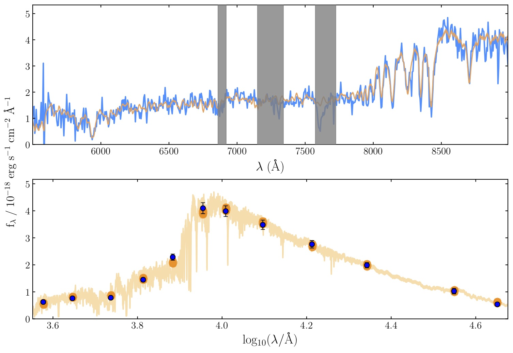
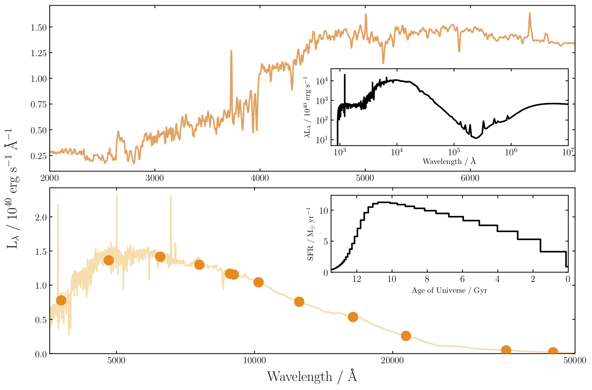

Bayesian Analysis of Galaxies for Physical Inference and Parameter EStimation is a state of the art Python code for modelling galaxy spectra and fitting spectroscopic and photometric observations.

Photometry and VLT/VIMOS spectrum for a z ~ 1 post-starburst galaxy (blue) fitted with Bagpipes.

Source and installation
-----------------------

Bagpipes can be installed using pip. The model grids the code requires mean the distribution is too large (200MB) to be hosted by PyPI, so pip must be linked through this site to the source files:

.. code::

	pip install -f https://bagpipes.readthedocs.io/en/latest/installation.html bagpipes

This should install all dependencies except for MultiNest. See the `installation <installation.html>`_ page for further information.

Bagpipes is developed at GitHub, view the source code at `github.com/ACCarnall/bagpipes <https://github.com/ACCarnall/bagpipes>`_.

Acknowledgements
----------------

Bagpipes is described in Section 3 of `Carnall et al. 2017 <https://arxiv.org/abs/1712.04452>`_, if you make use of Bagpipes in your research, please include a citation to this work in any publications. 

Bagpipes would not be possible without the following excellent projects:

 - The `MultiNest <https://ccpforge.cse.rl.ac.uk/gf/project/multinest>`_ nested sampling algorithm `(Feroz et al. 2013) <https://arxiv.org/abs/1306.2144>`_
 - The MultiNest python interface `PyMultiNest <https://johannesbuchner.github.io/PyMultiNest>`_ `(Buchner et al. 2014) <https://arxiv.org/abs/1402.0004>`_.
 - The stellar population models of `Bruzual \& Charlot (2003) <https://arxiv.org/abs/astro-ph/0309134>`_.
 - The `Cloudy <https://www.nublado.org>`_ photoionization code `(Ferland et al. 2017) <https://arxiv.org/abs/1705.10877>`_.

Getting started
---------------
Follow `this link <getting_started.html>`_ to get started with the code.

Example spectral and star-formation history models for a z = 0 passive galaxy.

.. toctree::
   :maxdepth: 2
   :hidden:

   installation.rst
   getting_started.rst
   filtlists.rst
   model_galaxies.rst
   loading_galaxies.rst
   fitting_galaxies.rst
   worked_example_1.rst

