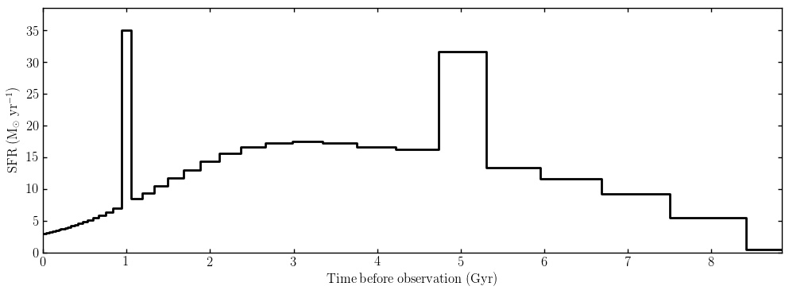

.. _making-model-galaxies:

Making model galaxies
=====================

Model galaxies in Bagpipes are created using the ``Model_Galaxy`` class. The most important argument passed to ``Model_Galaxy`` is the ``model_components`` dictionary, which contains all the physical parameters of the model.

.. _model-components:

The model_components dictionary
-------------------------------

The ``model_components`` dictionary must contain at least one star-formation history component, and may also contain components describing the effects of dust and nebular emission. Additionally there are a few global properties which can be specified, such as the redshift of the model. 

A simple example ``model_components`` dictionary describing a galaxy at redshift 0.5 with 10\ :sup:`11` Solar masses, formed in a single burst 1 Gyr before observation would be:

.. code:: python

	burst = {}
	burst["age"] = 1.0          # Age of the burst (Gyr)
	burst["metallicity"] = 1.0  # Stellar metallicity (old Solar units: Z_sol = 0.02)
	burst["massformed"] = 11.   # Log_10 of total mass formed by component (M_solar)

	model_components = {}
	model_components["burst"] = burst    # Add the burst sfh component to the model
	model_components["redshift"] = 0.5   # Observed redshift

A full description of the options which can be included in ``model_components`` to build up the complexity of a model is given :ref:`here <full-list>`.

Getting observables
-------------------------------------

**Model spectra**

We can use the ``model_components`` dictionary above to create a model galaxy as follows:

.. code:: python
	
	import bagpipes as pipes
	import numpy as np

	model = pipes.Model_Galaxy(model_components, output_specwavs=np.arange(2500., 7500., 5.))

	model.plot()

We now have a Bagpipes model galaxy! The final command generates a plot displaying the information we have requested, in this case the spectrum between 2500 -- 7500 Angstroms in the observed frame with sampling of 5 Angstroms. 

The output spectrum is stored as ``model.spectrum`` which is a two column numpy array, containing wavelengths in Angstroms and spectral fluxes in erg/s/cm^2/A by default. The output flux units can be converted to microJanskys using the ``Model_Galaxy`` keyword argument ``out_units_spec="mujy"``.

**Model photometry**

If instead we want model photometry, it is necessary to define a :ref:`filter list <filter-lists>`. Once this has been set up, we can pass the ``Model_Galaxy`` object a keyword argument called ``filtlist``.

.. code:: python
	
	import bagpipes as pipes
	import numpy as np

	model = pipes.Model_Galaxy(model_components, filtlist="PS1")

	model.plot()

Output photometry is stored as ``model.photometry``, and is a 1D array of flux values in erg/s/cm^2/A by default. The output flux units can be converted to microJanskys using the ``Model_Galaxy`` keyword argument ``out_units_phot="mujy"``. 

Photometric fluxes are returned in ``model.photometry`` in the same order as the filter curves were specified in the :ref:`filter list <filter-lists>` file.

**Emission line fluxes**

if a ``nebular`` component is added to ``model_components``, emission line fluxes will be stored in the ``model.line_fluxes`` dictionary. The list of available emission features are available `here <https://github.com/ACCarnall/bagpipes/blob/master/tables/nebular/cloudy_lines.txt>`_. 

Emission line naming conventions are the same as in Cloudy, the names in the above file are the keys fluxes are stored under in ``model.line_fluxes``. For example, the Lyman alpha flux is under:

.. code:: python

	model.line_fluxes["H  1  1215.67A"]

Emission line fluxes are returned in units of erg/s/cm^2.

**Note on units at redshift zero**

The units specified above apply at non-zero redshift. At redshift zero the luminosity distance is zero which would lead to a division by zero error. Therefore at redshift zero the code returns erg/s/A for spectra and photometry, and erg/s for emission line fluxes.

Updating models
---------------

Creating a new ``Model_Galaxy`` is relatively slow, however changing parameter values in ``model_components`` and calling the ``update`` method of ``Model_Galaxy`` extremely rapidly updates the output spectrum/photometry/emission lines. For example, if you wanted to change the age of the burst in the above example to 0.5 Gyr you would type the following:

.. code:: python

	model_components["burst"]["age"] = 0.5

	model.update(model_components)

Now all of the outputs described above have been changed to reflect the new burst age. This kind of example could be useful when building a model spectrum for a simulated galaxy from a list of star particles with different ages and masses.

It should be noted that the ``update`` method is designed to deal with changed parameter values, not adding or removing components of the model.

Model_Galaxy API documentation
----------------------------------

.. autoclass:: bagpipes.Model_Galaxy
	:members:

.. _full-list:

All model_components options
----------------------------

All of the physical parameters of a model are passed to ``Model_Galaxy`` within the ``model_components`` dictionary. The example :ref:`above <model-components>` is the simplest possible ``model_components`` dictionary. The rest of this page takes you through the options you can use to build up the complexity of your model. 

To understand the implementation of each of the options described below please consult Section 3 of `Carnall et al. 2017 <https://arxiv.org/abs/1712.04452>`_.

**Global options**

The ``model_components`` dictionary is mainly populated with dictionaries. these describe the star-formation history of the object, nebular emission and dust attenuation/emission. There are however some non-dictionary global options which can be added directly to ``model_components``. These are:

.. code:: python

	model_comp = {}
	model_comp["redshift"] = 0.5  # The redshift of the galaxy (required)
	model_comp["veldisp"] = 200.  # The velocity dispersion of the galaxy in km/s (optional)
	model_comp["t_bc"] = 0.01     # The lifetime of stellar birth clouds in Gyr (optional)

Whilst ``t_bc`` is listed as optional, it is a requirement if a ``nebular`` component is included in ``model_components``, or if the ``eta`` parameter is specified in the ``dust`` component.

**Dust component**

Three dust attenuation models are implemented in Bagpipes, the Calzetti et al. (2000) model, the Cardelli et al. (1989) model and a model based on Charlot & Fall (2001). The dictionary containing information on the dust model must be labelled as ``dust`` in ``model_components``. 

The parameters available are:

.. code:: python

	dust = {}
	dust["type"] = "Calzetti"  # Type of dust, other options "Cardelli", "CF00" (required)
	dust["Av"] = 0.25          # Absolute attenuation in the V band in magnitudes (required)
	dust["eta"] = 2.0          # Multiplicative factor on Av for stars in birth clouds (optional)
	dust["n"] = 0.55           # Power-law slope of attenuation law (required, "CF00" only)

	model_comp["dust"] = dust

**Nebular component**

The nebular model in Bagpipes has only one free parameter, it must be labelled as ``nebular`` in the ``model_components`` dictionary:

.. code:: python

	nebular = {}
	nebular["logU"] = -3.0     # Log_10 of the ionization parameter (required).

	model_comp["nebular"] = nebular

The metallicity of the gas in the stellar birth clouds is assumed to be the same as the stars providing the ionizing flux.

**Star formation history components**

Bagpipes builds up star-formation histories by superimposing multiple components. Multiple components of the same type should be labelled sequentially in ``model_components`` e.g. ``burst1``, ``burst2`` etc. 

All star formation history components take the following keys:

.. code:: python

	sfh_comp = {}
	sfh_comp["massformed"] = 11.   # Log_10 total stellar mass formed in Solar masses (required)
	sfh_comp["metallicity"] = 1.0  # Metallicity in old Solar units: Z_sol = 0.02 (required)

The different types of components available and the extra shape parameters they each take are shown below (the numerical values given are just placeholders):

.. code:: python

	burst = {}                 # Delta function burst of star formation
	burst["age"] = 1.0         # Time since burst in Gyr (required)

	constant = {}              # tophat function between some limits
	constant["agemax"] = 1.0   # Time since the constant switched on in Gyr (required)
	constant["agemin"] = 0.5   # Time since the constant switched off in Gyr (required)

	exponential = {}           # Tau model
	exponential["age"] = 5.0   # Time since star formation began in Gyr (required)
	exponential["tau"] = 1.0   # Timescale of exponential decrease in Gyr (required)

	delayed = {}               # Delayed Tau model e.g. Thomas et al. (2017)
	delayed["age"] = 5.0       # Time since star formation began in Gyr (required)
	delayed["tau"] = 1.0       # Timescale of exponential decrease in Gyr (required)

	lognormal = {}             # log-normal star formation history e.g. Gladders et al. (2013).
	lognormal["tmax"] = 5.0    # Age of Universe when star formation is at its max (required).
	lognormal["fwhm"] = 5.0    # Full width at half maximum of the log-normal (required).

	dblplaw = {}               # double-power-law e.g. Carnall et al. (2017).
	dblplaw["alpha"] = 30.0    # Falling slope power-law index (required).
	dblplaw["beta"] = 0.5      # Rising slope power-law index (required).
	dblplaw["tau"] = 5.0       # Age of Universe at turnover in Gyr (required).

	custom = {}                # A custom array of star formation rate values.
	custom["history"] = sfhist_array or "sfhist.txt"  # In this case, either a string 
	# containing the path to a file containing the star formation history, or an array 
	# containing it is expected. In either case the format is a column of ages in Gyr 
	# followed by a column of star formation rates in Solar masses per year (required).

**Putting it all together**

Below is an example script for generating a complex Bagpipes model, plotting its star-formation history and an output spectrum:

.. code:: python

	import numpy as np
	import bagpipes as pipes

	dust = {}
	dust["type"] = "Calzetti"
	dust["Av"] = 0.25
	dust["eta"] = 2.0

	nebular = {}
	nebular["logU"] = -3.0

	dblplaw = {}
	dblplaw["alpha"] = 10.
	dblplaw["beta"] = 0.5
	dblplaw["tau"] = 7.0
	dblplaw["massformed"] = 11.
	dblplaw["metallicity"] = 1.0

	burst1 = {}
	burst1["age"] = 5.0
	burst1["massformed"] = 10.
	burst1["metallicity"] = 0.2

	burst2 = {}
	burst2["age"] = 1.0
	burst2["massformed"] = 9.5
	burst2["metallicity"] = 0.5

	model_comp = {}
	model_comp["redshift"] = 0.5
	model_comp["veldisp"] = 300.
	model_comp["t_bc"] = 0.01
	model_comp["nebular"] = nebular
	model_comp["dust"] = dust
	model_comp["dblplaw"] = dblplaw
	model_comp["burst1"] = burst1
	model_comp["burst2"] = burst2

	model = pipes.Model_Galaxy(model_comp, output_specwavs=np.arange(5000., 11000., 5.))

	model.sfh.plot()

	model.plot()

The resulting plots:

.. image:: images/examplespec.jpg

