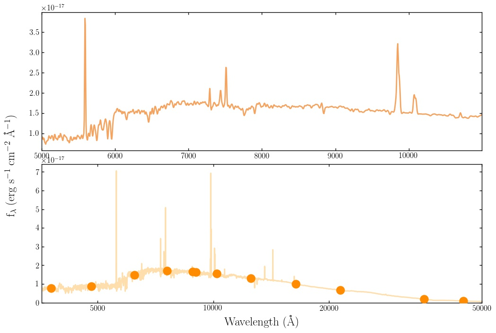

Obtaining model photometry: defining filter lists
======================================

Managing filter curves is one of the most annoying aspects of spectral fitting, I hope you'll find the interface I've set up reasonably intuitive!

First things first, Bagpipes uses a subdirectory called "pipes" within your working directory to store various inputs/outputs, including filter curves. To define a filter list (referred to as a "filtlist" within the code) you'll have to make the "pipes" directory and within it another directory called "filters". 

Within the "filters" directory, you should create a file with the name of the filter list you want to create, and the extension ".filtlist". For example, if I wanted to set up a PanSTARRS filter list, I'd call my file "PanSTARRS.filtlist". In this file, you'll have to add paths from the "filters" directory to the locations you're storing your filter curves. In order to find the curves you want I recommend the `SVO filter profile service <http://svo2.cab.inta-csic.es/svo/theory/fps>`_.

For example, if you downloaded the PS1 grizy filters and put them in a folder called "PanSTARRS" within the "filters" folder, you'd need a  "PanSTARRS.filtlist" filter list file which would look like:

.. code::

	PanSTARRS/PS1.g
	PanSTARRS/PS1.r
	PanSTARRS/PS1.i
	PanSTARRS/PS1.z
	PanSTARRS/PS1.y

You're then all set to start generating photometry. All you need to do is specify the name of your filtlist with the filtlist keyworld argument of Model_Galaxy:

.. code:: python

	model = pipes.Model_Galaxy(model_comp, filtlist="PanSTARRS")

If you want a spectrum too, you can keep the **output_specwavs** keyword argument from the previous page as well. You can then access the model photometry, which is returned as a 1D array of flux values in the same order as the filters are listed in your ".filtlist" file with:

.. code:: python

	print model.photometry

By default, photometry is returned in erg/s/cm^2/A, but both the photometry and spectrum can be converted to microjanskys using the **out_units_phot** and **out_units_spec** keyword arguments by specifying:

.. code:: python

	model = pipes.Model_Galaxy(model_comp, filtlist="PanSTARRS", out_units_phot="mujy")

Adding a filtlist keyword argument to the example shown at the end of the previous page returns an additional panel on the output plot:

