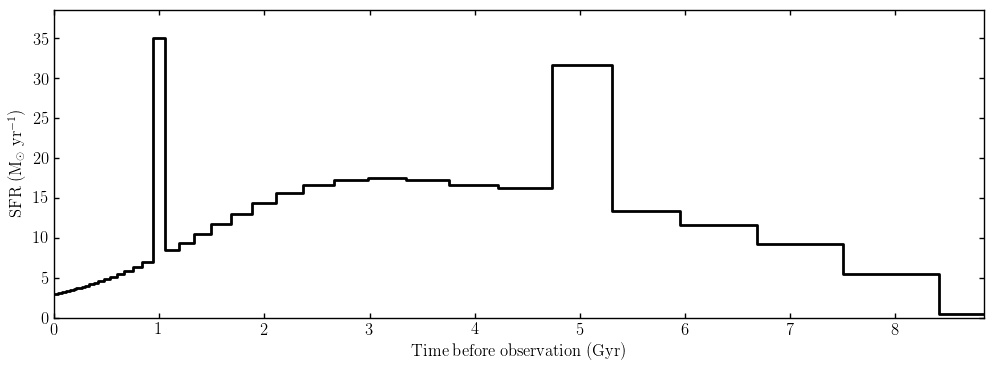
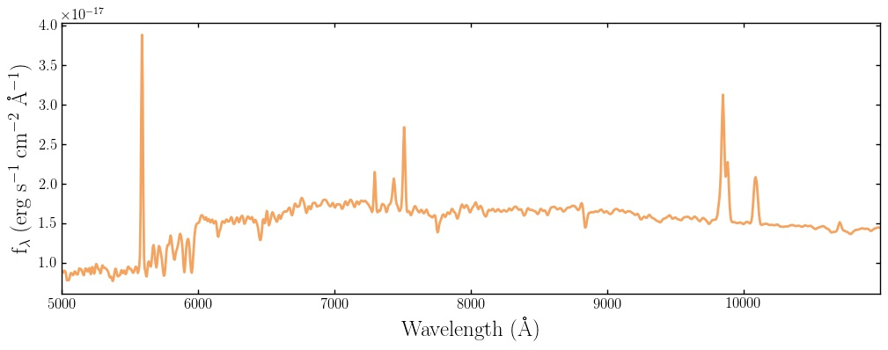

Generating models: the model_components dictionary
====================================

All of the attributes of the model galaxy you want to build are passed to **Model_Galaxy** in a **model_components** dictionary. 

A simple example script to build a **model_components** dictionary for a galaxy with 10\ :sup:`11` Solar masses which formed in a single burst of Solar metallicity star formation 1 Gyr before the galaxy is observed at redshift 0.5 would be:

.. code:: python

	burst = {}
	burst["age"] = 1.0
	burst["metallicity"] = 1.0
	burst["mass"] = 11.0

	model_components = {}
	model_components["zred"] = 0.5
	model_components["burst"] = burst

We can pass this model_components dictionary to the API as follows:

.. code:: python
	
	import bagpipes as pipes

	model = pipes.Model_Galaxy(model_components, output_specwavs=np.arange(2500., 7500., 5.))

	model.plot()

We now have a Bagpipes model galaxy! The final command generates a plot which displays the mock data we have requested, in this case a spectrum from 2500 to 7500 Angstroms with sampling of 5 Angstroms (all in the observed frame). We will learn how to obtain photometric output on the `next page <fields.html>`_.

This galaxy has no dust, no nebular emission, no velocity dispersion and the simplest possible star formation history. The rest of this page takes you through the options you can implement to build up the complexity of your model. To understand the implementation of each of the options described below you will need to consult Section 3 of `ArXiv1712.99999 <https://arxiv.org/abs/1712.99999>`_.

Global options
--------------

The **model_components** dictionary is mainly populated with dictionaries describing nebular emission, dust and the star formation history. There are however some non-dictionary global options which can be put directly into model_components. These are:

.. code:: python

	model_comp = {}
	model_comp["zred"] = 0.5      # The redshift of the galaxy (required)
	model_comp["veldisp"] = 200.  # The velocity dispersion of the galaxy in km/s (optional)
	model_comp["a_bc"] = 0.01     # The lifetime of stellar birth clouds in Gyr (optional)

Dust component
--------------

Three dust attenuation models are implemented in Bagpipes, the Calzetti et al. (2000) model, the Cardelli et al. (1989) model and a model based on the model of Charlot & Fall (2001). The dictionary containing information on the dust model must be labelled as "dust" in **model_components**. The parameters which are available for these models are:

.. code:: python

	dust = {}
	dust["type"] = "Calzetti"  # Type of dust, other options "Cardelli", "CF00" (required).
	dust["Av"] = 0.25          # Absolute attenuation in the V band in magnitudes (required).
	dust["eta"] = 3.0          # Extra birth cloud attenuation, a_bc must be specified (optional).

	dust["n"] = 0.55           # Power-law slope of attenuation law (required, "CF00" only).

	model_comp["dust"] = dust

Nebular component
-----------------

The nebular model in Bagpipes has only one free parameter, it must be labelled as "nebular" in the **model_components** dictionary:

.. code:: python

	nebular = {}
	nebular["logU"] = -3.0     # Logarithm of the ionization parameter (required).

	model_comp["nebular"] = nebular

Star formation history components
---------------------------------

Bagpipes builds up the star formation history of models from any number of components. Multiple components of the same type should be labelled sequentially in **model_components** e.g. "burst1", "burst2" etc. All star formation history components take the following keys:

.. code:: python

	sfh_comp = {}
	sfh_comp["mass"] = 11.         # Logarithm of total stellar mass formed in Solar masses (required)
	sfh_comp["metallicity"] = 1.0  # Metallicity of component in old Solar units.

The different types of components available and the extra shape parameters they each take are shown below:

.. code:: python

	burst = {}                 # Delta function burst of star formation.
	burst["age"] = 1.0         # Time since burst in Gyr (required).

	constant = {}              # tophat function between some limits
	constant["age"] = 1.0      # Time since the constant switched on in Gyr (required).
	constant["age_min"] = 0.5  # Time since the constant switched off in Gyr (required).

	exponential = {}           # Tau model.
	exponential["age"] = 5.0   # Time since exponential decrease began in Gyr (required).
	exponential["tau"] = 1.0   # Timescale of exponential decrease in Gyr (required).

	delayed = {}               # Delayed Tau model e.g. Thomas et al. (2017).
	delayed["age"] = 5.0       # Time since exponential decrease began in Gyr (required).
	delayed["tau"] = 1.0       # Timescale of exponential decrease in Gyr (required).

	lognormal = {}             # log-normal star formation history e.g. Gladders et al. (2013).
	lognormal["tmax"] = 5.0    # Age of Universe when star formation is at its max (required).
	lognormal["fwhm"] = 5.0    # Full width at half maximum of the log-normal (required).

	dblplaw = {}               # double-power-law e.g. Behroozi et al. (2013).
	dblplaw["alpha"] = 30.0    # Falling slope power-law index (required).
	dblplaw["beta"] = 0.5      # Rising slope power-law index (required).
	dblplaw["tau"] = 5.0       # Age of Universe at turnover in Gyr (required).

	custom = {}                # A custom array of star formation rate values.
	custom["history"] = sfhist_array or "sfhist.txt"  # In this case, either a string 
	# containing the path to a file containing the star formation history, or an array 
	# containing it is expected. In either case the format is a column of ages in Gyr 
	# followed by a column of star formation rates in Solar masses per year (required).

Putting it all together
-----------------------

Below is an example script for generating a complex Bagpipes model, plotting its SFH and plotting the resulting spectrum:

.. code:: python

	import numpy as np
	import bagpipes as pipes

	dust = {}
	dust["type"] = "Calzetti"
	dust["Av"] = 0.25
	dust["eta"] = 2.0

	nebular = {}
	nebular["logU"] = -3.0

	dblplaw = {}
	dblplaw["alpha"] = 10.
	dblplaw["beta"] = 0.5
	dblplaw["tau"] = 7.0
	dblplaw["mass"] = 11.
	dblplaw["metallicity"] = 1.0

	burst1 = {}
	burst1["age"] = 5.0
	burst1["mass"] = 10.
	burst1["metallicity"] = 0.2

	burst2 = {}
	burst2["age"] = 1.0
	burst2["mass"] = 9.5
	burst2["metallicity"] = 0.5

	model_comp = {}
	model_comp["zred"] = 0.5
	model_comp["veldisp"] = 300.
	model_comp["a_bc"] = 0.01
	model_comp["nebular"] = nebular
	model_comp["dust"] = dust
	model_comp["dblplaw"] = dblplaw
	model_comp["burst1"] = burst1
	model_comp["burst2"] = burst2

	model = pipes.Model_Galaxy(model_comp, output_specwavs=np.arange(5000., 11000., 5.))

	model.sfh.plot()

	model.plot()

This produces two plots, one of the total star formation history and one of the requested spectral data.

Accessing output
----------------

Finally, let's look at accessing the attributes of the model we've just created. The spectrum and emission line fluxes can be accessed as follows:

.. code:: python

	print model.spectrum   # two column array with wavelengths in Angstroms and fluxes,
	                       # by default in erg/s/cm^2/A, or erg/s/A at redshift zero.
	
	print model.line_fluxes["H  1  1215.67A"]  # Lyman alpha flux in erg/s/cm^2 or erg/s
	                                           # at redshift zero.

A list of possible emission line names can be found in the folder "bagpipes/lookup_tables/pipes_cloudy_lines.dat".

Obtaining model photometry will be covered on the next page.

